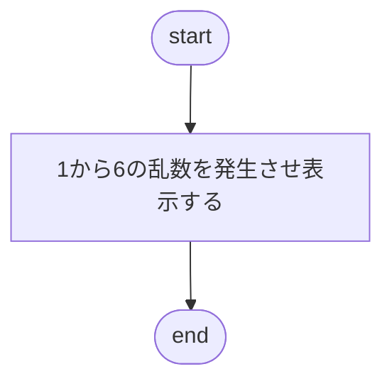

# 単純なさいころ

## 出題

```shell
> python dice01.py
```

を実行すると、1 から 6 までの整数をランダムに出力するプログラムを作成してください。

## ファイル名

dice01.py

## 実行例

```sell:出力例
> python dice01.py
6
> python dice01.py
4
```

## フローチャート


