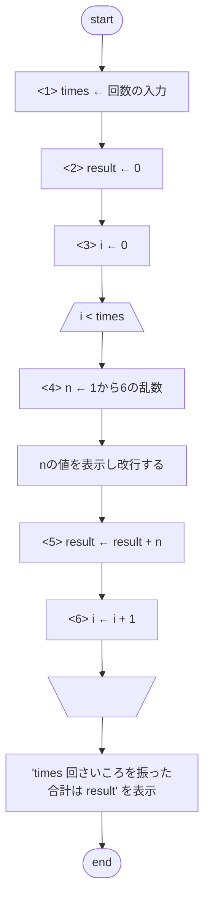

# 振る回数を指定できるさいころ

## 出題

```shell
> python dice03.py
```

を実行すると、"何回さいころを振りますか?整数で入力してください:"と表示し、
キーボードから整数を入力するとその回数 1 から 6 までのランダムな整数と、最後に"n 回さいころを振った合計は m"(n は回数、m はでた目の合計値)を出力するプログラムを作成してください。

## ファイル名

dice03.py

## 実行例

```sell:出力例
> python dice03.py
何回さいころを振りますか?整数で入力してください:3
3
1
5
3 回さいころを振った合計は 9
> python dice02.py
何回さいころを振りますか?整数で入力してください:6
3
2
2
5
4
1
5 回さいころを振った合計は 17

```

## フローチャート



## 変数の変化

回数を 3 と入力した場合の変数の値の変化は以下のようになります。

### <1>

| 変数名 | 値  | 備考                                         |
| ------ | --- | -------------------------------------------- |
| times  | 3   | キーボードからの入力文字列を整数に変換した値 |

### <2>

| 変数名 | 値  | 備考                                     |
| ------ | --- | ---------------------------------------- |
| times  | 3   |                                          |
| result | 0   | でた目の合計値を保存する変数の初期値は 0 |

### <3>

| 変数名 | 値  | 備考                                       |
| ------ | --- | ------------------------------------------ |
| times  | 3   |                                            |
| result | 0   |                                            |
| i      | 0   | 繰り返し回数をカウントする変数の初期値は 0 |

### <4> (1 回目)

| 変数名 | 値  | 備考                      |
| ------ | --- | ------------------------- |
| times  | 3   |                           |
| result | 0   |                           |
| i      | 0   |                           |
| n      | 3   | 1 から 6 のランダムな整数 |

### <5> (1 回目)

| 変数名 | 値  | 備考                            |
| ------ | --- | ------------------------------- |
| times  | 3   |                                 |
| result | 3   | 0 + 3 元の値に n の値を加算する |
| i      | 1   |                                 |
| n      | 3   |                                 |

### <6> (1 回目)

| 変数名 | 値  | 備考            |
| ------ | --- | --------------- |
| times  | 3   |                 |
| result | 3   |                 |
| i      | 1   | 0 から 1 増やす |
| n      | 3   |                 |

### <4> (2 回目)

| 変数名 | 値  | 備考                      |
| ------ | --- | ------------------------- |
| times  | 3   |                           |
| result | 3   |                           |
| i      | 1   |                           |
| n      | 1   | 1 から 6 のランダムな整数 |

### <5> (2 回目)

| 変数名 | 値  | 備考                            |
| ------ | --- | ------------------------------- |
| times  | 3   |                                 |
| result | 3   | 3 + 1 元の値に n の値を加算する |
| i      | 1   |                                 |
| n      | 1   |                                 |

### <6> (2 回目)

| 変数名 | 値  | 備考            |
| ------ | --- | --------------- |
| times  | 3   |                 |
| result | 3   |                 |
| i      | 2   | 1 から 1 増やす |
| n      | 3   |                 |

### <4> (3 回目)

| 変数名 | 値  | 備考                      |
| ------ | --- | ------------------------- |
| times  | 3   |                           |
| result | 3   |                           |
| i      | 2   |                           |
| n      | 5   | 1 から 6 のランダムな整数 |

### <5> (3 回目)

| 変数名 | 値  | 備考                            |
| ------ | --- | ------------------------------- |
| times  | 3   |                                 |
| result | 8   | 3 + 5 元の値に n の値を加算する |
| i      | 2   |                                 |
| n      | 1   |                                 |

### <6> (3 回目)

| 変数名 | 値  | 備考            |
| ------ | --- | --------------- |
| times  | 3   |                 |
| result | 8   |                 |
| i      | 3   | 1 から 1 増やす |
| n      | 3   |                 |

## 発展課題

- 0 や負の数を入力したらどうなりますか?
  - 条件分岐によるエラーメッセージの表示
  - 例外処理によるエラーメッセーッジの表示
- 数字以外を入力したらどうなりますか?
  - 条件分岐によるエラーメッセージの表示
  - 例外処理によるエラーメッセーッジの表示
- アナログゲームで使われる nDm 表記(3D10 なら 10 面体 3 個の合計)に対応したい
  - 正規表現を使用して文字列から数値を取り出す
- さいころを画像で表示したい
  - アスキーアート文字列のリストを用意して表示する
  - python に同梱されている tkinter ライブラリを使用して GUI プログラムを作成
  - Pand3D ライブラリなどを使用して 3D グラフィックスを作成
